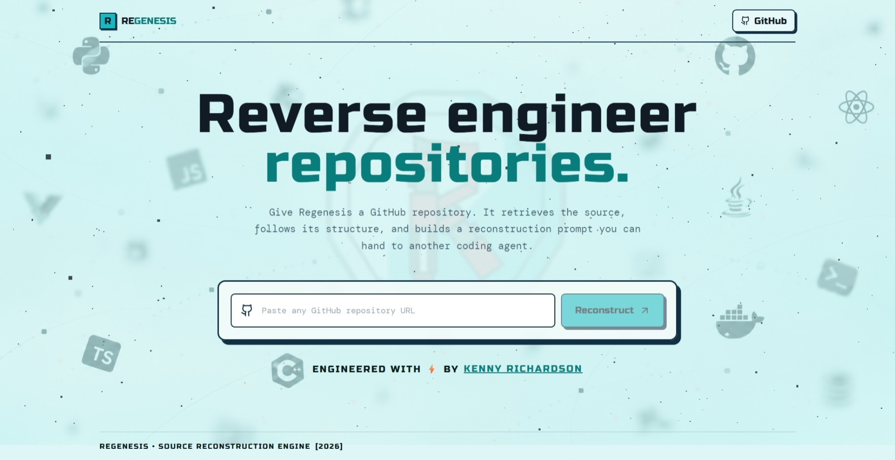
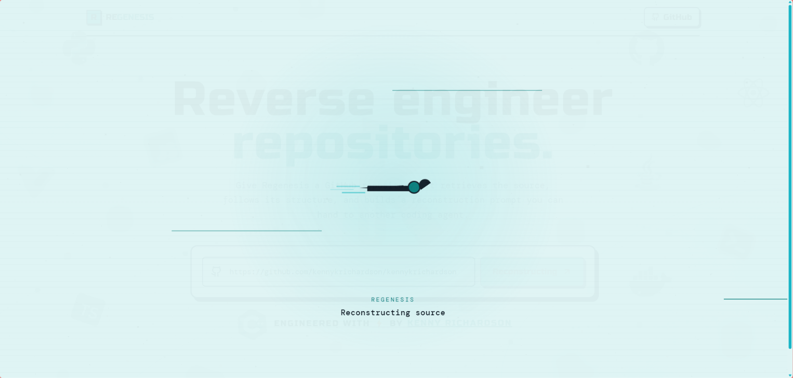
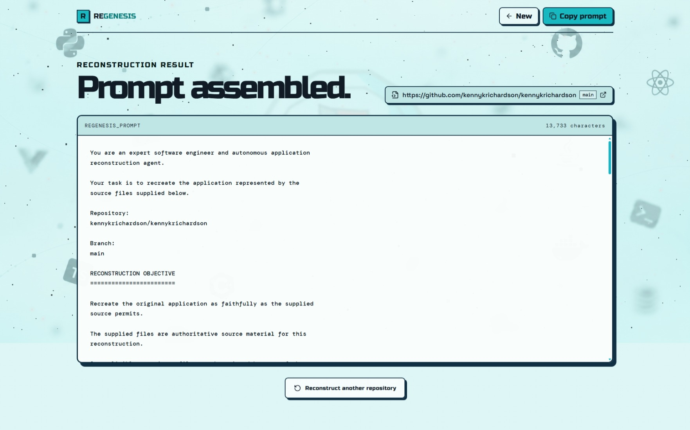

# 🌋 Regenesis

## GitHub Repository Reconstruction System

Regenesis is a software project that retrieves source code from a GitHub repository, analyzes the repository structure and source relationships, and builds a deterministic reconstruction prompt for coding agents.

The generated prompt can be copied into tools such as **Codex**, **Claude Code**, **Antigravity**, or another coding agent to recreate the supplied application from its available source.

## 📌 Project Status

**Status:** Active project  
**Project:** Regenesis  
**Author:** Kenny Richardson Kodipally
**Year:** 2026

---

# 🎯 What Regenesis Does

The main workflow is:

```text
GitHub Repository URL
        ↓
GitHub Repository Metadata
        ↓
Git Tree
        ↓
Git Blobs
        ↓
Source File Collection
        ↓
Deterministic File Classification
        ↓
Dependency Discovery
        ↓
Dependency-Aware Source Selection
        ↓
Reconstruction Prompt
        ↓
Copy Prompt
        ↓
Coding Agent
        ↓
Reconstructed Application
```

The core purpose is **source reconstruction**, not repository grading or repository health analysis.

---

# 🧠 Core Backend

The backend is implemented with **Python and FastAPI**.

### Backend responsibilities

### `backend/api.py`

Creates the FastAPI application, registers the API router, and provides basic application metadata.

### `backend/server.py`

Runs the FastAPI application through Uvicorn.

### `backend/routes.py`

Provides the public HTTP API:

- `POST /api/prompt`
- `POST /api/generate`
- `GET /api/health`

### `backend/schemas.py`

Contains request and response models used by the API.

### `backend/regenesis.py`

Contains shared configuration, GitHub configuration, environment loading, repository parsing, and GitHub-related exceptions.

### `backend/codebase.py`

Retrieves repository source through the GitHub REST API.

The source retrieval pipeline uses:

- GitHub repository metadata
- Git trees
- Git blobs
- Base64 decoding
- Deterministic ordering
- File-type detection
- File exclusion rules
- Blob-size limits
- Blob caching

The module intentionally does not perform repository health analysis, commit analysis, issue analysis, pull-request analysis, scoring, or LLM inference.

### `backend/prompt_builder.py`

Builds the reconstruction prompt.

It performs:

- File classification
- Entry-point detection
- Dependency discovery
- JavaScript / TypeScript import tracing
- Python import tracing
- Path-aware dependency resolution
- Dependency-aware source selection
- Source-size limiting
- Deterministic file ordering
- Reconstruction prompt generation

The current prompt configuration uses:

- `MAX_PROMPT_TOKENS = 14,000`
- `MAX_SOURCE_TOKENS = 12,000`
- `MAX_CRITICAL_FILES = 64`
- `MAX_CRITICAL_SOURCE_FILE_TOKENS = 4,000`

The exact source included in a generated prompt depends on the repository being reconstructed and the configured source budget.

### `backend/inference.py`

Provides optional LLM generation through the Hugging Face Inference Provider.

The inference layer is separate from the deterministic reconstruction pipeline.

Regenesis can therefore generate the reconstruction prompt without requiring an LLM.

---

# 🖥️ Frontend

The frontend uses:

- ⚛️ React
- 🟦 TypeScript
- ⚡ Vite
- 🎨 CSS
- 🧊 Three.js / React Three Fiber
- 🎞️ Framer Motion
- 🧩 Lucide React

The current interface intentionally contains only two primary pages:

```text
LandingPage
     ↓
ResultPage
```

# Screenshots

## 📡 Regenesis Landing Page



---

## 📡 Regenesis Landing Page



---

## 📈 AI-Powered Prompt generation



## 🏠 Landing Page

The landing page provides:

- Regenesis branding
- GitHub repository input
- Branch input
- Reconstruction action
- Responsive layout
- Animated particle background
- Programming-technology background artwork
- Repository-focused visual design

## 📄 Result Page

The result page provides:

- Repository identity
- Branch information
- Generated reconstruction prompt
- Copy-to-clipboard functionality
- External repository link
- New reconstruction action

The result page intentionally avoids the old Orzyn report interface.

---

# 🔌 API

## `POST /api/prompt`

Retrieves a GitHub repository and builds its reconstruction prompt.

### Request

```json
{
  "repository": "https://github.com/owner/repository",
  "branch": "main"
}
```

The branch value is optional when the backend can use the repository's default branch.

### Response

The response contains:

- Repository
- Branch
- Reconstruction prompt
- Included files
- Excluded files
- Estimated token count

---

## `POST /api/generate`

Sends a supplied reconstruction prompt to the configured Hugging Face inference provider.

### Request

```json
{
  "prompt": "..."
}
```

### Response

The response contains:

- Generated response
- Model
- Provider

This endpoint is optional to the primary workflow.

---

## `GET /api/health`

Returns:

```json
{
  "status": "ok"
}
```

This endpoint is only an operational backend health check.

It is **not** repository health scoring.

---

# 🧩 Source Selection

Regenesis does not simply dump every repository file into a prompt.

The source-selection system considers:

- Entry points
- Configuration files
- Source files
- Imports
- Exports
- JavaScript and TypeScript dependencies
- Python imports
- Relative paths
- Referenced modules
- Source size
- Prompt token budget

The objective is to include the source that provides the most useful reconstruction information while keeping the generated prompt within the configured budget.

---

# 🛠️ Installation

## Requirements

Install:

- Python 3.x
- Node.js
- npm
- Git

A GitHub token is recommended for repository access.

An Hugging Face token is only required if the optional `/api/generate` endpoint is used.

---

# ⚙️ Backend Setup

From the project root:

```bash
python -m venv .venv
```

### Windows

```powershell
.venv\Scripts\Activate.ps1
```

### Install Python dependencies

```bash
pip install -r requirements.txt
```

### Environment variables

Create a `.env` file in the project root:

```env
GITHUB_TOKEN=your_github_token

HF_TOKEN=your_huggingface_token
HF_MODEL=Qwen/Qwen2.5-Coder-7B-Instruct
HF_PROVIDER=auto
MAX_OUTPUT_TOKENS=6000
```

`HF_TOKEN` is only necessary for optional LLM generation.

Do not commit `.env` to GitHub.

The repository `.gitignore` excludes environment files.

---

# ▶️ Running the Backend

Run:

```bash
python -m uvicorn backend.api:app --host 127.0.0.1 --port 8000 --reload
```

The backend will be available at:

```text
http://127.0.0.1:8000
```

---

# 🌐 Frontend Setup

Open the frontend directory:

```bash
cd frontend
```

Install dependencies:

```bash
npm install
```

Run the development server:

```bash
npm run dev
```

Vite will provide the local development URL.

The frontend uses the backend API configured through:

```env
VITE_API_URL=http://127.0.0.1:8000/api
```

If no frontend API URL is configured, the application uses the local API fallback.

---

# 🏗️ Production Build

From `frontend/`:

```bash
npm run build
```

The build performs TypeScript checking and the Vite production build.

Preview the production build with:

```bash
npm run preview
```

---

# 📁 Project Structure

```text
Regenesis/
│
├── backend/
│   ├── api.py
│   ├── server.py
│   ├── routes.py
│   ├── schemas.py
│   ├── regenesis.py
│   ├── codebase.py
│   ├── prompt_builder.py
│   └── inference.py
│
├── frontend/
│   ├── public/
│   │   ├── favicon.svg
│   │   ├── assets/
│   │   │   └── HeroBackground.png
│   │   └── fonts/
│   │       └── RussoOne.ttf
│   │
│   ├── src/
│   │   ├── components/
│   │   ├── hooks/
│   │   ├── pages/
│   │   │   ├── LandingPage.tsx
│   │   │   └── ResultPage.tsx
│   │   ├── services/
│   │   ├── App.tsx
│   │   ├── main.tsx
│   │   └── styles.css
│   │
│   ├── index.html
│   ├── package.json
│   ├── tsconfig.json
│   └── vite.config.ts
│
├── .env
├── .gitignore
├── LICENSE
├── README.md
└── requirements.txt
```

---

# 🔐 Security

Do not commit:

- GitHub tokens
- Hugging Face tokens
- `.env` files
- Private repository credentials
- API keys
- Local secrets

Use environment variables for credentials.

---

# ⚠️ Current Limitations

Regenesis reconstructs an application from the source that it can retrieve and include within its configured prompt budget.

Important limitations include:

- Very large repositories may not fit completely inside one reconstruction prompt.
- Binary files are not treated as normal source files.
- Individual source blobs are limited before retrieval.
- Some lower-priority files may be excluded from a prompt.
- Reconstruction quality depends on the available source.
- An omitted source file is not evidence that the original repository did not contain that file.
- The optional LLM generation route depends on the configured Hugging Face provider and model.
- Regenesis does not guarantee that another coding agent will reproduce the original application perfectly.

---

# 📚 Design Principles

Regenesis follows several implementation principles:

### 1. Deterministic source processing 🔒

The same repository state should produce a consistent source-selection process.

### 2. Source-first reconstruction 💻

The source files are the primary reconstruction material.

### 3. Dependency awareness 🧩

Important files are selected using relationships between entry points, imports, configuration, and referenced modules.

### 4. No repository grading 📊

Regenesis does not calculate repository health scores.

### 5. No unrelated analysis 🚫

The reconstruction pipeline does not depend on commits, issues, pull requests, or repository reports.

### 6. LLM independence 🤖

The deterministic prompt-generation workflow does not require an LLM.

### 7. Preservation over redesign 🔧

The generated reconstruction instructions prioritize preserving the supplied application's architecture, functionality, styling, dependencies, routing, state management, API contracts, and runtime configuration when the source establishes them.

---

# 🧪 Development Workflow

A typical development cycle is:

```text
1. Start FastAPI backend
2. Start Vite frontend
3. Enter a GitHub repository
4. Generate reconstruction prompt
5. Inspect the generated prompt
6. Copy the prompt
7. Send it to a coding agent
8. Reconstruct the application
9. Test the result
10. Improve Regenesis when necessary
```

---

# 🏫 Student Project Context

Regenesis is a student software engineering project created to demonstrate practical work across:

- 🌐 Web development
- ⚛️ React
- 🟦 TypeScript
- 🐍 Python
- ⚡ FastAPI
- 🔗 REST APIs
- 🐙 GitHub APIs
- 🧩 Dependency analysis
- 🧠 Prompt engineering
- 🤖 LLM integration
- 📦 Software architecture
- 📱 Responsive frontend development

The project also demonstrates how an existing software project can be substantially repurposed into a new application with a different objective, architecture, interface, and backend workflow.

---

# 👤 Author

**Kenny Richardson**

GitHub: `kennykrichardson`

---

# 📜 License

Regenesis is released under the **MIT License**.

See [`LICENSE`](./LICENSE) for the complete license text.

---

# 🔁 Project History

```text
Orzyn
  ↓
Existing repository and developer-intelligence codebase
  ↓
Substantial refactoring and removal of analysis/reporting features
  ↓
GitHub source retrieval retained and redesigned
  ↓
Deterministic source classification
  ↓
Dependency-aware source selection
  ↓
Reconstruction prompt generation
  ↓
New Regenesis frontend
  ↓
REGENESIS
GitHub Repository Reconstruction System
```

**Orzyn and Regenesis are separate projects.**

Regenesis is the second project produced from the earlier Orzyn codebase.
